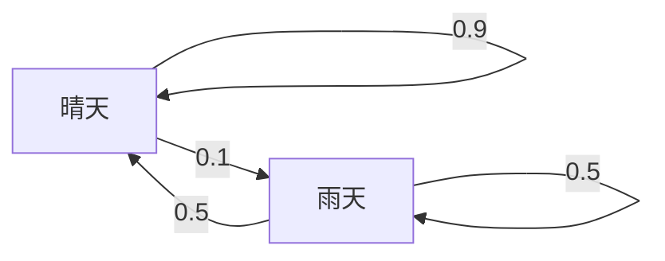

---
tags:
  - work
date: 2025-11-11
location: SHANGHAI
---
# ✅ **今日待办事项（Top 3）**  
- [ ] 🎯 1.  
- [ ] 🔧 2.  
- [ ] 📚 3.  

---
# 🕒 **时间轴日志（07:00 - 23:00）**

|      时间段      |   📌 事项记录   | ❗ 问题记录 | 🧩 原因分析 | 🛠️ 解决方案 | 🚀 关键进展 |
| :-----------: | :---------: | :----: | :-----: | :------: | :-----: |
| 08:00 - 09:00 |  📋 规划全天事项  |        |         |          |         |
| 09:00 - 10:00 |             |        |         |          |         |
| 10:00 - 11:00 |             |        |         |          |         |
| 11:00 - 12:00 |             |        |         |          |         |
| 12:00 - 13:00 | 🍽️ 午餐 / 休息 |        |         |          |         |
| 13:00 - 14:00 |             |        |         |          |         |
| 14:00 - 15:00 |             |        |         |          |         |
| 15:00 - 16:00 |             |        |         |          |         |
| 16:00 - 17:00 |             |        |         |          |         |
| 17:00 - 18:00 |             |        |         |          |         |
| 18:00 - 19:00 | 🍽️ 晚餐 / 休息 |        |         |          |         |
| 19:00 - 20:00 |             |        |         |          |         |
| 20:00 - 21:00 |             |        |         |          |         |
| 21:00 - 22:00 |   📝 今日总结   |        |         |          |         |

---
# 💼 **工作记录**

> 记录今日具体工作内容、PR、Bug 修复、会议纪要、关键决策等。

- 📌 工作内容一：
- 📌 工作内容二：
- 📌 重要讨论：

---
# 🔋 **今日充电 / 学习**

> 阅读文章、课程、视频、技术文档、博客摘要等

## Emboided AI

`aloha`

>[!QUESTION]
>具身智能和模仿学习、强化学习的关系？

## 马尔可夫决策过程

**1. 马尔可夫链**

**马尔可夫链**（Markov Chain) 的核心是“**未来只取决于现在，而与过去无关**”，也被称为**马尔可夫性** 或**无记忆性**。
$$
P(s_{t+1} \mid s_t, s_{t-1}, \cdots, s_0) = P(s_{t+1} \mid s_t), \quad \forall s_0, s_1, \cdots, s_t, s_{t+1} \in S
$$

给定**初始状态分布$\rho$**，可完整表示**状态转移过程**，即可以递归计算某个状态`i`在时间`t`出现的概率:

$$
\mathbb{P}(s_t = i) = \sum_{j \in S} \mathbb{P}(s_{t-1} = j) \cdot p_{j,i}
$$

**2. 马尔可夫决策过程**

**马尔可夫决策过程**（Markov Decision Process，MDP）是马尔可夫链的拓展。
$$
P(s_{t+1} \mid s_t, a_t, s_{t-1}, \cdots, s_0) = P(s_{t+1} \mid s_t, a_t), \quad \forall s_0, s_1, \cdots, s_t, s_{t+1} \in S
$$

**3. 无限长度的折扣马尔可夫决策过程**

**4. 有限长度回合制马尔可夫决策过程**

- [Imitation Learning: behavioral cloning](https://lei00764.github.io/posts/2025-04-22-Behavioral%20Cloning/index.html)
- [许天, 李子牛, 俞扬. 模仿学习简洁教程. 2021](https://www.lamda.nju.edu.cn/xut/docs/Imitation_Learning.pdf)

---
# 🧠 **总结与反思**

| 项目         | 内容          |
| ---------- | ----------- |
| 🎯 是否达成目标  | ✅ / ❌（简要说明） |
| 🧱 今日遇到的困难 | ...         |
| 🧰 解决方法    | ...         |
| ✨ 明日优化点    | ...         |
| 💭 今日感受    | ...         |

---
# 📌 **明日计划**

- [ ] ✅ 工作目标 1  
- [ ] 🧪 学习 / 实验 2  
- [ ] 📬 跟进事项 3  

---
# 📷 小结图像 / 灵感（可选）

> 可插入截图、草图、脑图或灵感点子等  
> ``

---
# 📎 备注  
> 自定义标签: `#daily #log #2025-11-11`
