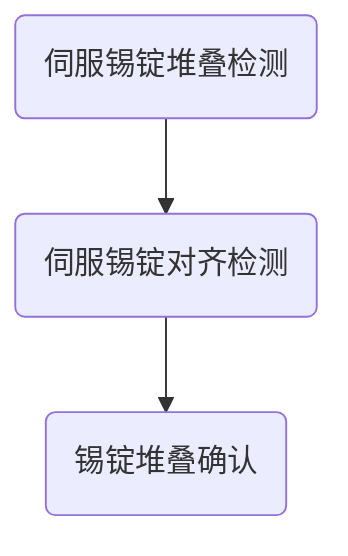

# 一、项目概述
项目为`VN25021`，需实现`5`层**锡锭堆叠**。
![[Pasted image 20250530135130.png]]

| 现状                                                     | 痛点                                                                  | 解决方案                                  |
| ------------------------------------------------------ | ------------------------------------------------------------------- | ------------------------------------- |
| 1. 货物为锡锭，无托盘； 2. 堆叠5层，货物底部为支腿状，非平面堆叠  3. 货物有高度变化 | 1. **现有检测算法无法稳定识别锡锭**  2. **不具备高精度堆叠算法**  3. 堆不准时不具备堆叠可行性判断方案 | **1. 非标锡锭堆叠闭环算法** 2. 非标锡锭堆叠可行性判断方案 |

为解决上述现状和痛点，需进行**非标锡锭堆叠闭环算法**开发。
# 二、锡锭堆叠闭环技术方案
## 2.1 锡锭堆叠闭环流程
堆叠闭环包括三个阶段：

三个阶段采用的算法：
1. 伺服锡锭堆叠检测：使用现有卷积托盘检测算法。
2. 伺服锡锭对齐检测：感知新开发，算法流程参考本文档。
3. 锡锭堆叠确认：固件调用2次感知检测，进行确认计算。

|   检测阶段   |            检测算法             |
| :------: | :-------------------------: |
| 伺服锡锭堆叠检测 |      detect_pallet_KL2      |
| 伺服锡锭对齐检测 | detect_cage_stack_tin_ingot |
|  锡锭堆叠确认  | detect_cage_stack_tin_ingot |

## 2.2 锡锭堆叠对齐算法流程
算法流程：
1. 原始数据，通过固件下发的目标点，以及卡板参数，进行ROI操作，区分上面锡锭以及下方锡锭。
2. 下方锡锭，经过点云预处理，降采样等操作，进行平面拟合，确认下方锡锭平面的yaw角
3. 下方锡锭，经过离群点过滤，通过最大值与最小值的方式，计算出下方锡锭上边缘中心的位姿，作为下方锡锭的位姿。
4. 上方锡锭，根据货叉高度，货叉宽度等参数，进行货叉过滤。
5. 进一步地、根据步骤4处理后，统计上方锡锭的x y z的范围，进一步的过滤噪点。
6. 如该锡锭，是标准堆叠位的数据，则可保存为锡锭堆叠模板。
7. 将模板与当前处理后的上方锡锭做icp匹配，得到当前锡锭相对于模板锡锭的位姿。
8. 利用步骤3和步骤7的结果，计算出位姿差，返回给固件。
9. 通过下方锡锭位姿及初始ROI，计算下方锡锭上方ROI，判断该ROI内有无点云，若有，则认为没有放货空间。

![[Pasted image 20250530140247.png]]

![[Pasted image 20250606155955.png]]
## 2.3 锡锭堆叠对齐公式推导

![[锡锭堆叠公式推导.png]]

$$
\begin{aligned}
T^{A_{模板}}_{AGV} = (loadPositionX,0,0,0,0,0)\\
T^{A}_{AGV} = T^{A_{模板}}_{AGV} * T^{A}_{A_{模板}} \\
T^{B}_{A} = T^{B}_{AGV} - T^{A}_{AGV} 
\end{aligned}
$$

将$T^{B}_{A}$转换为$diff(x,y,z,r,p,y)$后，还要考虑**货叉横移**和`loadPositionX`的影响。

即
$$
\begin{aligned}
goal.x = diff.x + loadPositionX\\
goal.y = diff.y + forkpose.y\\
goal.yaw = diff.yaw\\
\end{aligned}
$$

# 三、实现效果

## 3.1 稳定性

静止过程稳定性...
伺服过程稳定性...
## 3.2 精度

取货到位时精度...
取货不到位时精度...
## 3.3 耗时

单次检测耗时500 `ms`。

# 四、问题与解决方案

## 4.1 跳变问题
跳变问题排查可分为3个方面

1. 硬件问题：雷达、里程计、
2. 软件问题
3. 感知、控制问题、

%% [[Daily Notes/2025.05/2025.05.12-2025.05.18/周报#一、货叉固定跳变排查]] %%
 %%[[Daily Notes/2025.05/2025.05.12-2025.05.18/周报#二、货叉横移跳变排查]] %%
%% [[Daily Notes/2025.05/2025.05.12-2025.05.18/周报#三、点云缺失排查]] %%
%% [[2025-05-26#上方锡锭计算方法修改]] %%

# 五、总结与展望

%% 不足：
1. 排查问题没有运用系统性思维
2. 解决问题时犹犹豫豫，顾前顾后

改进：
1. 针对伺服漂移问题，可从**硬件**、**静态稳定性**、**伺服曲线**三个方面系统思考
2. 发现问题之后针对某个方案快速实现，快速测试 %%
