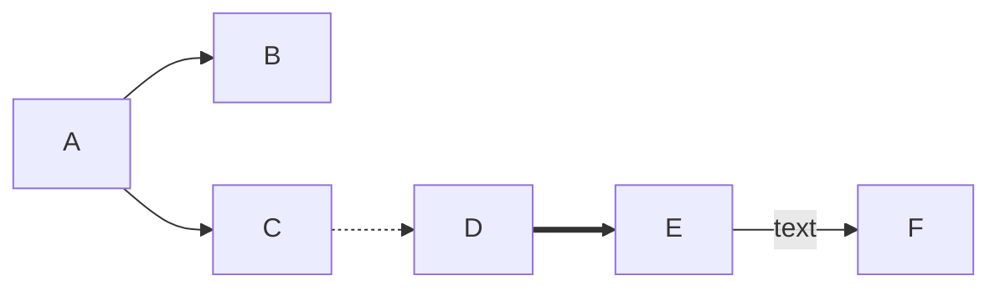
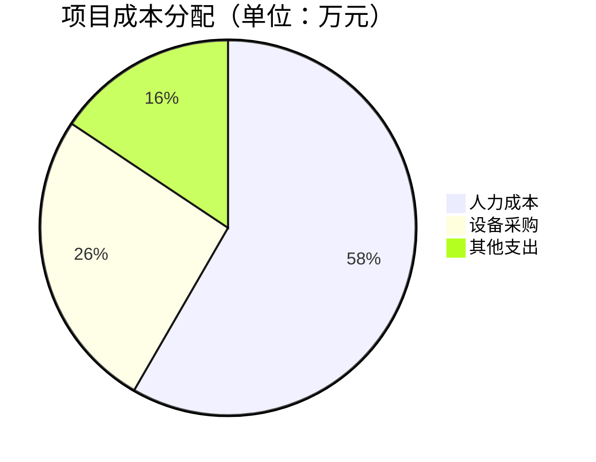

# Install

```bash
# 通过Snap安装
sudo snap install obsidian --classic 
```
# Use

```
笔记开头输入"---"可添加属性
```

==highlight== 

**bold** ^[this is a footnote]
__bold__

*italics*
_italics_

~~delete~~

- item1
- item2
    * item2-1
    * item2-2
- item3 

1. item1
2. item2
	1. item2-1
	2. item2-2
3. item3

- [x] task1
- [x] task2 

> this is somethong I said
>> this is also something I said


>[!note]
>this is a note 


>[!bug]


>[!error]
>this is a error


| Name | Category | Color | Luster |
| :--: | :------: | :---: | :----: |
|  1   |    2     |   3   |   4    |

`pip install -r requirements.txt`

```python
import cv2

```

[Obsidian Help](https://help.obsidian.md)

%% This is a comment %%

$x^2 + y^2 = z^2$

$$
\int_{-\infty}^{\infty} e^{-x^2} dx = \sqrt{\pi}
$$

<span style="color: blue; font-weight: bold;">蓝色粗体文本</span>







