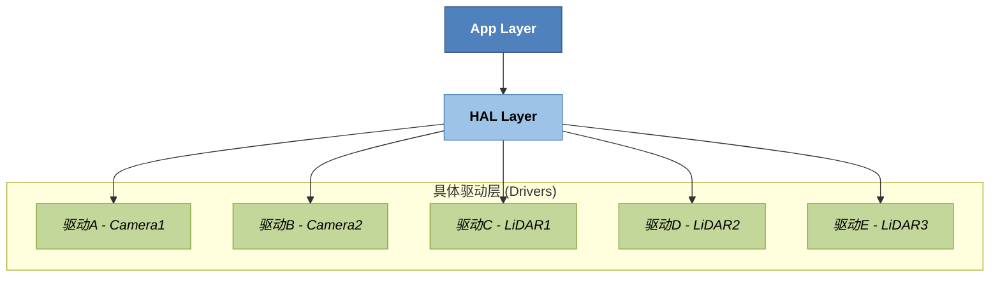

#  一、工作回顾

## 1.标定房公式推导
对于calibType == 2的情况:
1.标定时:
$$
\begin{align}
T_{fork} * E_{ori0} * E_{ori1} * P_{ori1} &= P_{sensorpool1}  & \text{(1)}\\
T_{trans0} * T_{1to0} *   P_{sensorpool1} &= P_{AGV1} & \text{(2)}\\
\end{align}
$$
$$
\begin{align}
%% T_{fork} * E_{ori0} * E_{ori1} * P_{ori1} &= P_{sensorpool}  & \text{(1)}\\ %%
%% T_{trans0} * T_{1to0} *   P_{sensorpool1} &= P_{AGV1} & \text{(2)} %%
 %% T_{trans0} * T_{1to0} *   T_{fork} * E_{ori0} * E_{ori1} * P_{ori1} &= P_{AGV1} & \text{(2)} %%
\end{align}
$$
联立上述(1)、（2）两式，可得：
$$
\begin{align}
  T_{trans0} * T_{1to0} *   T_{fork} * E_{ori0} * E_{ori1} * P_{ori1} &= P_{AGV1} & \text{(3)} 
\end{align}
$$
2.标定后:
$$
\begin{align}
  T_{fork} * E_{robotune0} * E_{robotune1} * P_{ori1} &= P_{AGV1} & \text{(4)} \\
  E_{robotune0} = T^{-1}_{fork} * T_{trans0} * T_{fork} &* E_{ori0} & \text{(5)}
\end{align}
$$

联立上述(4)、（5）两式，可得：
$$
\begin{align}
  T_{fork} *  T^{-1}_{fork} * T_{trans0} * T_{fork} * E_{ori0} &*  E_{robotune1} * P_{ori1} = P_{AGV1}& \text{(6)} \\
\end{align}
$$

3.求解
联立（3）、（6）两式，可得：
$$
\begin{align}
  T_{fork} *  T^{-1}_{fork} * T_{trans0} * T_{fork} * E_{ori0} &*  E_{robotune1} * P_{ori1} = T_{trans0} * T_{1to0} *   T_{fork} * E_{ori0} * E_{ori1} * P_{ori1}& \text{(7)} \\
\end{align}
$$
得到：
$$
\begin{align}
  E_{robotune1} = E^{-1}_{ori0} * T^{-1}_{fork} * T_{1to0} *   T_{fork} * E_{ori0} &* E_{ori1}& \text{(8)} \\
\end{align}
$$
## 2.VN25021锡锭堆叠

### 算法开发
算法流程：
1. 原始数据，通过固件下发的目标点，以及卡板参数，进行ROI操作，区分上面锡锭以及下方锡锭。
2. 下方锡锭，经过点云预处理，降采样等操作，进行平面拟合，确认下方锡锭平面的yaw角
3. 下方锡锭，经过离群点过滤，通过最大值与最小值的方式，计算出下方锡锭上边缘中心的位姿，作为下方锡锭的位姿。
4. 上方锡锭，根据货叉高度，货叉宽度等参数，进行货叉过滤。
5. 进一步地、根据步骤4处理后，统计上方锡锭的x y z的范围，进一步的过滤噪点。
6. 如该锡锭，是标准堆叠位的数据，则可保存为锡锭堆叠模板。
7. 将模板与当前处理后的上方锡锭做icp匹配，得到当前锡锭相对于模板锡锭的位姿。
8. 利用步骤3和步骤7的结果，计算出位姿差，返回给固件。
9. 通过下方锡锭位姿及初始ROI，计算下方锡锭上方ROI，判断该ROI内有无点云，若有，则认为没有放货空间。
![[Pasted image 20250530140247.png]]

### 问题支持

[[锡锭堆叠问题支持]]

## 3.感知火焰图分析

[[感知cpu占用性能分析]]

## 4.感知驱动适配层
[[感知驱动适配]]

# 二、重点成果

1. 锡锭堆叠
![[Pasted image 20250701130737.png]]

2. 感知驱动适配
![[Pasted image 20250606151750.png]]

# 三、存在问题与反思

## 项目管理方面

- **问题**：部分项目在中后期出现进度延误
    
- **原因分析**：    
    1. 前期需求沟通不充分，变更频繁        
    2. 对关键路径和风险点预判不足
        
- **反思**：需在项目初期加强与相关方的对齐，并引入更明确的里程碑机制和风险预案管理

## 时间管理与优先级判断

- **问题**：部分任务被临时事项打断，导致重要事项被延迟    
- **原因分析**：    
    1. 对工作优先级评估不够清晰        
    2. 对时间预估偏乐观，缺乏缓冲机制
    
- **反思**：需优化任务规划方式，采用“重要-紧急矩阵”合理排序，预留可控弹性时间
- 工作中遇到的挑战和难点
    
