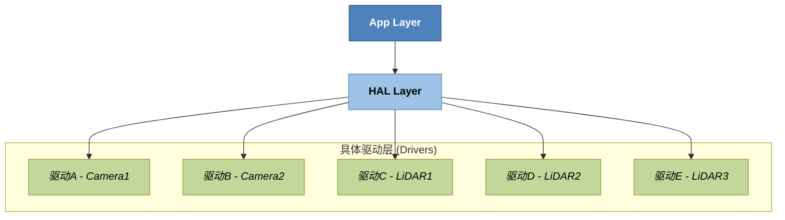

# Ecal
`enhanced Communication Abstraction Layer`

[introduction](https://eclipse-ecal.github.io/ecal/stable/getting_started/introduction.html)
[ecal](https://github.com/eclipse-ecal/ecal)
![[Pasted image 20250528191254.png]]


# 驱动适配层

## 驱动(Driver)和适配层(Hardware Abstraction Layer)的区别

1. 驱动是一个软件模块，负责**控制和管理硬件设备**，提供一个标准的接口，让上层应用能够方便地访问硬件功能，而不需要关心硬件底层的具体实现细节。

| 硬件设备            | 驱动模块                      | 提供的接口            |
| --------------- | ------------------------- | ---------------- |
| 摄像头 (Camera)    | UVC 驱动、V4L2 驱动            | 打开摄像头、设置分辨率、获取图像 |
| 激光雷达 (LiDAR)    | LiDAR SDK 驱动              | 启动/停止、获取点云数据     |
| 网络设备 (Ethernet) | 网卡驱动 (e1000, r8169, etc.) | 发送/接收数据包         |
| 传感器 (IMU)       | I2C/SPI 总线驱动 + 设备专用驱动     | 读加速度、角速度         |

2. 驱动适配层是一层 **中间层接口**，它位于**应用层**和**底层驱动**之间，提供 **统一的、抽象化的接口**，屏蔽底层硬件差异，使上层应用能够使用 **相同的 API** 操作不同厂商或型号的设备。



## 框架


## 实现


## details
1. `std::thread`
```cpp
// 使用new在堆区创建对象
auto thread = new std::thread(&LdsLidar_ecal::startEcalProcess, this);
thread->join();

// 在栈区创建对象
std::thread thread(&LdsLidar_ecal::startEcalProcess, this);
thread->join();

// 直接调用
startEcalProcess();
```

| 区域                | 存储内容                         | 生命周期        | 例子              |
| ----------------- | ---------------------------- | ----------- | --------------- |
| 代码区（text段）        | 程序的机器码（指令）                   | 程序运行期间只读    | 函数代码等           |
| 全局/静态区（data/bss段） | 全局变量、静态变量                    | 程序运行期间      | `static int a;` |
| 栈区（stack）         | 局部变量、函数参数                    | 随函数调用自动分配释放 | `int x = 10;`   |
| 堆区（heap）          | 程序运行时动态分配的内存（`new`/`malloc`） | 程序员手动控制释放   | `new int(10)`   |

2. `std::string`
```cpp
// 字符串数组
std::string per_ip[M360NUM_MAX];
```

3. `for`
```cpp


```

4. cmake
```cmake

# 第三方依赖库
# 设置 CMake 在后续的 `find_package` 调用中优先使用 Config 模式
set(CAMKE_FIND_PACKAGE_PREFER_CONFIG ON)
find_package(eCAL REQUIRED)
set(CMAKE_FIND_PACKAGE_PREFER_CONFIG OFF)
```

